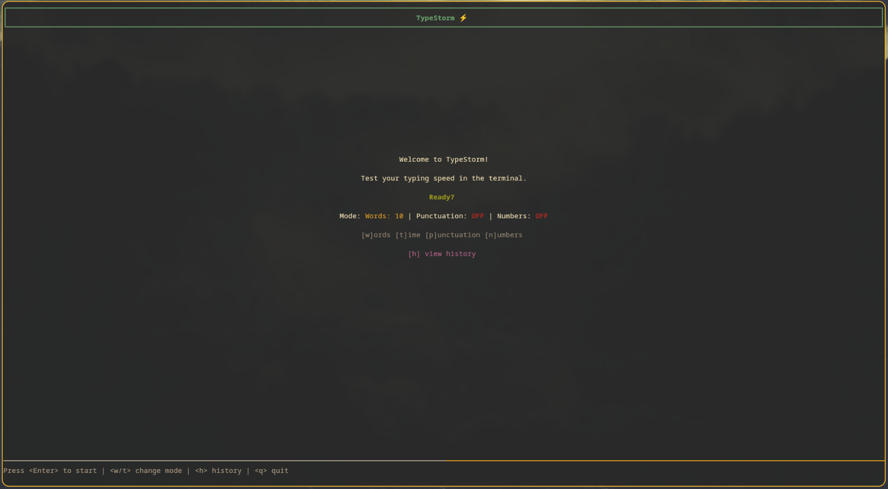
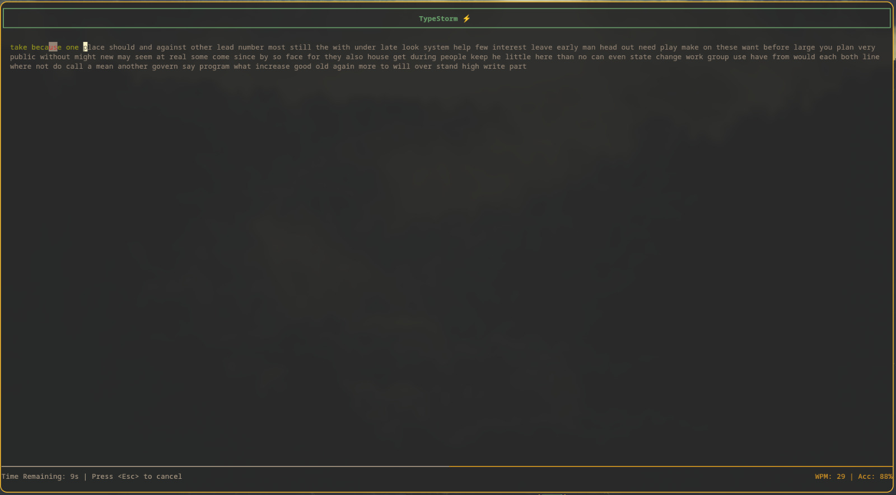
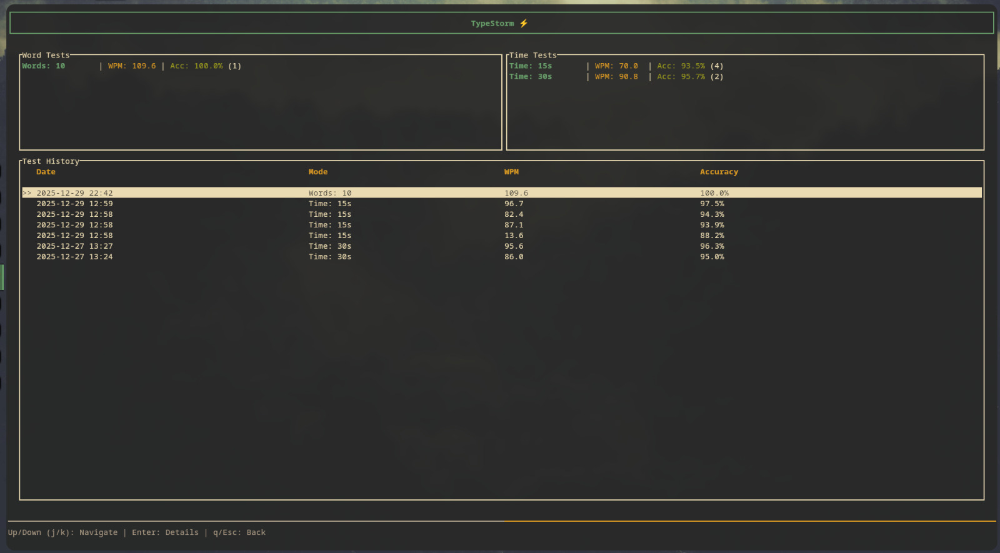

# TypeStorm ⚡

TypeStorm is a lightning-fast, terminal-based typing speed checker written in Rust. It brings the aesthetics and functionality of modern web-based typing tests directly to your CLI.



## ✨ New Features

*   **History Tracking**: Your test results are automatically saved locally.
*   **Performance Graphs**: View detailed WPM and Error charts for every test you take.
*   **Multiple Modes**: Support for both Word-count (10/25/50/100) and Time-based (15/30/60s) tests.
*   **Split Statistics**: Analyze your performance separately for Word-based and Time-based tests.

## 📦 Installation

TypeStorm is available on [crates.io](https://crates.io/crates/typestorm). Install it easily with cargo:

```bash
cargo install typestorm
```

## 🚀 Quick Start

Once installed, simply run:

```bash
typestorm
```

Or run directly from source:
```bash
cargo run
```

## 🎮 How to Use

### Main Menu
The landing page allows you to configure your test before starting.

*   `w`: Cycle **Word** modes (10 -> 25 -> 50 -> 100).
*   `t`: Cycle **Time** modes (15s -> 30s -> 60s).
*   `p`: Toggle **Punctuation**.
*   `n`: Toggle **Numbers**.
*   `h`: View **History**.
*   `Enter`: Start the test.

### Typing Test
Type the text displayed on the screen. The timer starts as soon as you press the first key.



*   **Green**: Correct character.
*   **Red**: Incorrect character.
*   **Gray**: Pending character.

### Analysis & Results
After the test, see your WPM, Accuracy, and a beautiful graph of your speed over time.


### History
Press `h` from the main menu to track your progress.



*   **Aggregate Stats**: View your average WPM and Accuracy split by **Word Tests** and **Time Tests**.
*   **Detailed Records**: Scroll through your past tests key-by-key.
*   **Deep Dive**: Select any past record to view its specific performance graph.

## 🎨 Design Philosophy

TypeStorm was built with three core principles in mind:

### 1. Terminal-First Minimalism
We believe tools should live where developers live: the terminal. TypeStorm provides a distraction-free environment without the bloat of a web browser.

### 2. Performance & Safety
Built with **Rust**, TypeStorm leverages the language's memory safety and speed. It uses `ratatui` for efficient rendering and `crossterm` for cross-platform compatibility.

### 3. Modern Aesthetics
CLI tools don't have to look ancient. We prioritize a clean, colorful, and responsive UI that feels "premium" to use.

## 🛠️ Tech Stack

*   **Language**: Rust
*   **UI Engine**: [Ratatui](https://github.com/ratatui-org/ratatui)
*   **Terminal Backend**: [Crossterm](https://github.com/crossterm-rs/crossterm)
*   **Persistence**: Serde & JSON
